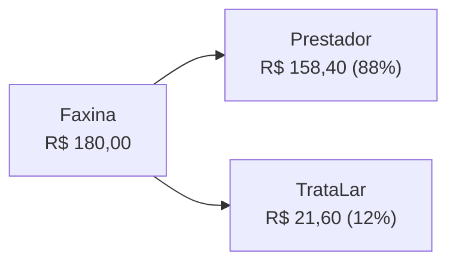
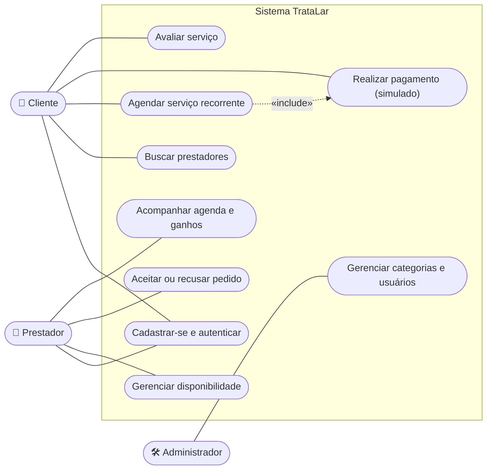
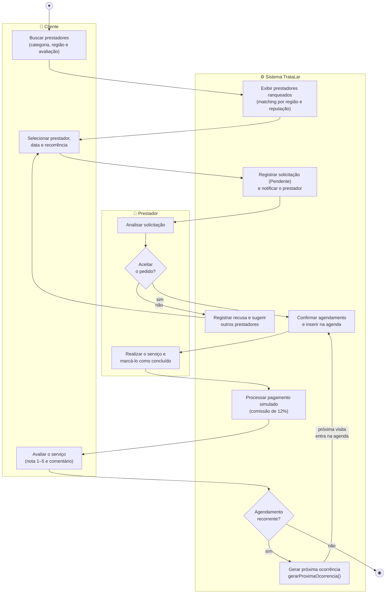
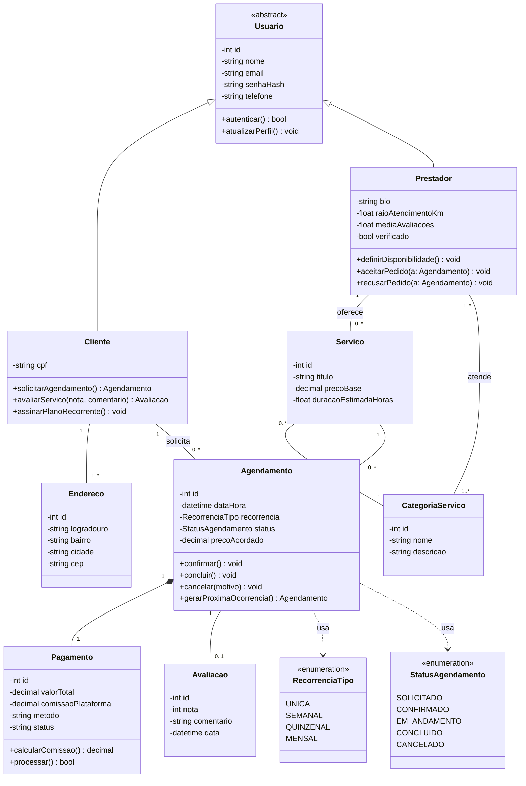
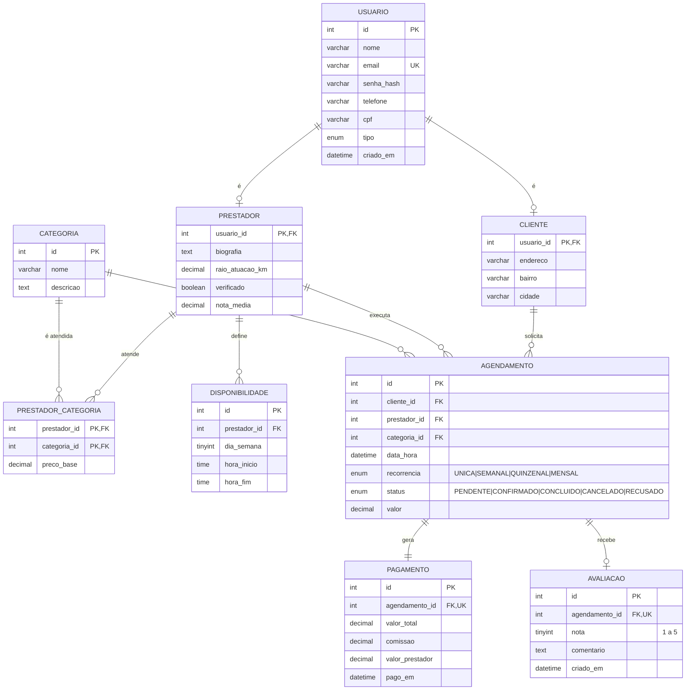
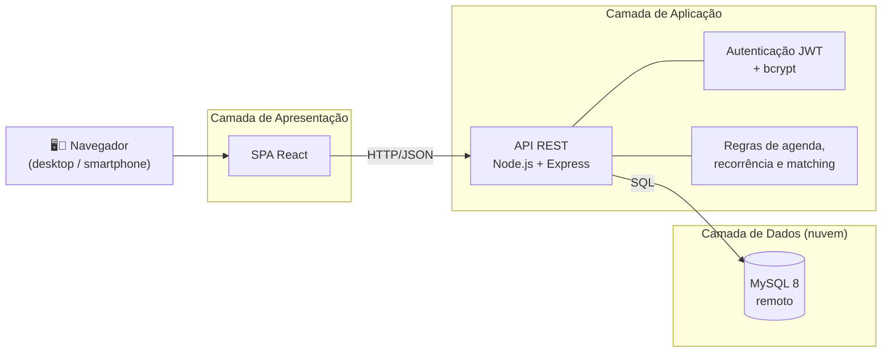
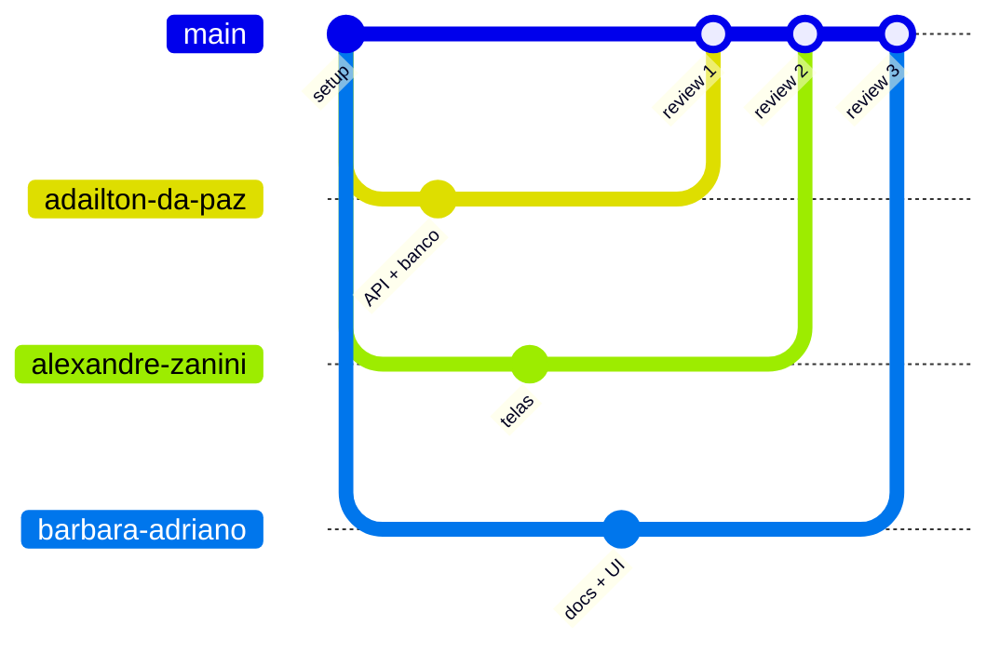
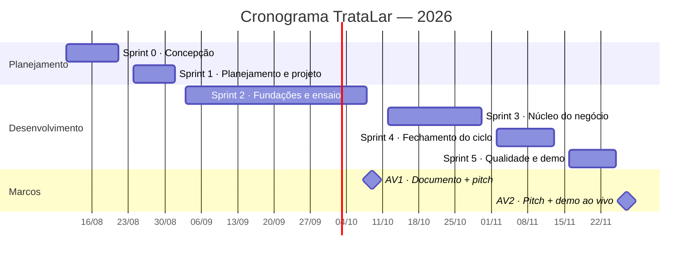
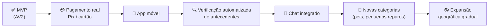

# 🏡 TrataLar

> **A plataforma do cuidado contínuo do lar.**
> Contratação de diaristas, jardineiros e piscineiros verificados, com agendamento recorrente e comissão cobrada **apenas sobre serviços concluídos**.

| | |
|---|---|
| **Disciplina** | Experiência Profissional: Fábrica de Software — AV1 |
| **Professor** | Everton Pereira da Cruz |
| **Equipe** | Adailton da Paz · Alexandre Zanini · Barbara Adriano |
| **Repositório** | [github.com/PazAdailton/Tratalar](https://github.com/PazAdailton/Tratalar) |
| **Stack** | React · Node.js/Express · MySQL 8 (remoto) |
| **Metodologia** | *Gerenciamento de Projetos em 7 Passos* (Terribili Filho, 2025) + Scrum adaptado |

---

## 📑 Sumário

- [Resumo executivo](#-resumo-executivo)
- [O problema](#-o-problema)
- [A solução e os diferenciais](#-a-solução-e-os-diferenciais)
- [Mercado e concorrência](#-mercado-e-concorrência)
- [Público-alvo](#-público-alvo)
- [Modelo de negócio](#-modelo-de-negócio)
- [Escopo do MVP](#-escopo-do-mvp)
- [Requisitos](#-requisitos)
- [Modelagem do sistema](#-modelagem-do-sistema)
- [Arquitetura e tecnologias](#-arquitetura-e-tecnologias)
- [Equipe e versionamento](#-equipe-e-versionamento)
- [Cronograma](#-cronograma)
- [Custos e viabilidade financeira](#-custos-e-viabilidade-financeira)
- [Comunicação e riscos](#-comunicação-e-riscos)
- [Lançamento, execução e encerramento](#-lançamento-execução-e-encerramento)
- [Roadmap](#-roadmap-pós-disciplina)
- [Referências](#-referências)

---

## 🎯 Resumo executivo

O **TrataLar** é uma plataforma web que conecta moradores a prestadores de serviços domésticos verificados — **diaristas, jardineiros e piscineiros** — com foco em **contratação recorrente** (semanal, quinzenal ou mensal).

Diferentemente do líder de mercado, que cobra do profissional pela simples *chance* de contato com o cliente, o TrataLar só é remunerado quando o serviço é efetivamente realizado, por meio de **comissão de 12%**.

**Por que agora?**

- 📈 A contratação de diaristas passou a fazer parte da rotina dos lares brasileiros (IBGE, 2025), impulsionada pelo envelhecimento da população, pela presença crescente das mulheres no mercado de trabalho e pela preferência por serviços recorrentes.
- 😤 O principal player do setor acumula reclamações públicas de prestadores sobre o modelo de venda de leads.

Demanda em alta + insatisfação com o modelo vigente = **janela de oportunidade**.

---

## 🧩 O problema

Manter uma casa exige uma rede de profissionais de confiança. Hoje essa rede é montada informalmente (indicação de vizinhos, grupos de bairro) ou por plataformas generalistas que tratam cada serviço como evento isolado.

| 👨‍👩‍👧 Dores do cliente | 🧹 Dores do prestador |
|---|---|
| Insegurança ao deixar um desconhecido entrar em casa | Renda instável |
| Preços imprevisíveis | Agenda ociosa entre serviços pontuais |
| Sem garantia de comparecimento | Pagar antecipadamente por contatos que muitas vezes não respondem |
| Renegociar tudo a cada visita | Nenhum incentivo à fidelização |

> **Problema central:** não existe uma plataforma focada em transformar serviços domésticos em **relações recorrentes e verificadas**, com preço transparente e **sem custo antecipado** para o profissional.

---

## 💡 A solução e os diferenciais

| Diferencial | Descrição |
|---|---|
| 🚫 **Zero cobrança por lead** | O prestador não paga para tentar. A plataforma só ganha quando o serviço é concluído. |
| 🔁 **Recorrência nativa** | O cliente monta o **"plano do lar"** (ex.: faxina semanal + piscina quinzenal). Prestador ganha agenda previsível; cliente, tranquilidade. |
| ✅ **Confiança verificada** | Perfis com documento validado e avaliações feitas **somente** por quem contratou. |
| 🧠 **Matching inteligente** | Sugestão de prestadores por proximidade, disponibilidade e reputação; sugestão de preço por região e tamanho do imóvel. |
| 🎯 **Foco vertical** | Três categorias bem servidas em vez de centenas atendidas superficialmente. |

### Objetivo geral

Desenvolver e lançar uma plataforma web que conecte clientes a prestadores de serviços domésticos verificados, com agendamento recorrente integrado e cobrança de comissão (12%) apenas sobre serviços concluídos.

### Objetivos específicos

- Cadastro e autenticação de clientes e prestadores, com perfis verificados;
- Busca por categoria (diarista, jardinagem, piscina), região e reputação;
- Agendamento com recorrência (única, semanal, quinzenal, mensal) e agenda do prestador;
- Pagamento simulado com cálculo automático da comissão de 12%;
- Avaliações (nota 1–5) feitas somente por contratantes reais;
- Painel administrativo de categorias e usuários.

---

## 📊 Mercado e concorrência

### Visão geral dos concorrentes

| Plataforma | Escala | Modelo de receita | Oportunidade para o TrataLar |
|---|---|---|---|
| **GetNinjas** | Líder nacional; +900 tipos de serviço; desde 2011 | Venda de "moedas" para desbloquear contatos (*pay-per-lead*) | Prestador paga sem garantia; reclamações de leads frios e falsos; generalista; sem recorrência |
| **Parafuzo** | +2 mi de serviços desde 2014; +200 cidades | Comissão sobre serviço agendado, preço fechado | Só limpeza; recorrência limitada à faxina; sem visão integrada da casa |
| **Triider** | Relevante no Sul; manutenção e reformas | Orçamentos (até 3 em 24h) e taxa sobre serviços | Foco em serviços pontuais; orçamento lento para rotina; sem agenda recorrente |
| **Mercado informal** | Dominante | Sem intermediação | Sem verificação, sem avaliações, sem garantia — **o verdadeiro concorrente a converter** |

### Matriz comparativa de funcionalidades

| Funcionalidade | **TrataLar** | GetNinjas | Parafuzo | Triider |
|---|:---:|:---:|:---:|:---:|
| Foco em recorrência | ✅ | ❌ | 🟡 | ❌ |
| Sem cobrança por lead | ✅ | ❌ | ✅ | ✅ |
| Multi-serviço do lar (faxina + jardim + piscina) | ✅ | ✅* | ❌ | 🟡 |
| Preço transparente antes da contratação | ✅ | ❌ | ✅ | 🟡 |
| Avaliações só de contratantes reais | ✅ | 🟡 | ✅ | ✅ |
| Agenda integrada do prestador | ✅ | ❌ | 🟡 | ❌ |
| Sugestão inteligente de preço e prestador | ✅ | ❌ | ❌ | ❌ |

<sub>✅ Sim · 🟡 Parcial · ❌ Não — \*O GetNinjas cobre as categorias, mas como pedidos avulsos e desconectados. Fontes: sites oficiais e Reclame Aqui (2025/2026).</sub>

### Posicionamento

> Os concorrentes disputam o **serviço avulso**; nenhum é dono da **relação recorrente**. O TrataLar se posiciona como *"a plataforma do cuidado contínuo do lar"* — nicho vertical, modelo justo com o prestador e experiência desenhada para repetição. Um cliente recorrente vale múltiplas vezes um cliente avulso, com custo de aquisição único.

---

## 👥 Público-alvo

| Persona | Perfil |
|---|---|
| **1. "Família sem tempo"** (cliente) | Casais de 30 a 55 anos, classes A/B, em casas ou condomínios, que já gastam R$ 150–300 por diária e querem **previsibilidade e segurança**, não o menor preço. |
| **2. "Profissional autônomo"** (prestador) | Diaristas, jardineiros e piscineiros que buscam **renda estável** e recusam pagar antecipadamente por contatos incertos. |

**Outros stakeholders:** equipe do projeto (desenvolvedora e patrocinadora), professor e banca, parceiros futuros (lojas de piscina/jardinagem, contabilidades), fornecedores (nuvem MySQL, GitHub, gateway futuro), governo (LGPD, legislação de trabalho autônomo) e mídia local.

---

## 💰 Modelo de negócio

Marketplace com **comissão de 12%** sobre cada serviço concluído — sem mensalidade e sem venda de leads.



| Indicador | Valor |
|---|---|
| Receita da plataforma por lar com faxina semanal | ≈ **R$ 86/mês** recorrentes |
| Renda líquida do prestador por lar com faxina semanal | ≈ **R$ 634/mês** (R$ 158,40 × 4) |

**Fontes futuras complementares:** plano de destaque para prestadores (assinatura opcional) e parcerias com produtos de piscina e jardinagem.

---

## 📦 Escopo do MVP

O MVP contempla o **ciclo completo de valor** em ambiente web responsivo:

- ✔️ Cadastro e autenticação de clientes e prestadores
- ✔️ Busca com filtros por categoria, bairro e avaliação
- ✔️ Perfil do prestador com reputação
- ✔️ Solicitação de agendamento com recorrência
- ✔️ Aceite ou recusa pelo prestador
- ✔️ Agenda do prestador
- ✔️ Pagamento simulado com cálculo de comissão
- ✔️ Avaliação pós-serviço
- ✔️ Painel administrativo de categorias e usuários

### Fora do escopo (nesta fase)

- ⛔ Pagamento real com gateway (Pix/cartão) — será **simulado**, com a regra de comissão implementada
- ⛔ Aplicativo móvel nativo (o site será responsivo)
- ⛔ Verificação automatizada de antecedentes (selo "verificado" atribuído pelo administrador)
- ⛔ Chat em tempo real e notificações por e-mail/push

---

## 📋 Requisitos

### Requisitos funcionais

| Código | Requisito | Prioridade |
|---|---|---|
| RF01 | Cadastrar cliente com nome, e-mail, telefone, CPF e endereço | 🔴 Essencial |
| RF02 | Cadastrar prestador com categorias atendidas, raio de atuação e biografia | 🔴 Essencial |
| RF03 | Autenticar usuários com e-mail e senha (hash + token JWT) | 🔴 Essencial |
| RF04 | Buscar prestadores por categoria, bairro/cidade e nota média | 🔴 Essencial |
| RF05 | Exibir perfil do prestador com avaliações e selo de verificação | 🔴 Essencial |
| RF06 | Solicitar agendamento com data, horário e recorrência | 🔴 Essencial |
| RF07 | Permitir ao prestador aceitar ou recusar solicitações | 🔴 Essencial |
| RF08 | Exibir agenda do prestador com serviços confirmados e ganhos estimados | 🔴 Essencial |
| RF09 | Registrar avaliação (nota 1–5 e comentário) apenas após serviço concluído | 🔴 Essencial |
| RF10 | Simular pagamento ao concluir serviço, calculando comissão de 12% | 🔴 Essencial |
| RF11 | Painel administrativo para gerenciar categorias e usuários | 🟠 Importante |
| RF12 | Gerar automaticamente a próxima ocorrência de um agendamento recorrente | 🟠 Importante |

### Requisitos não funcionais

| Código | Categoria | Requisito |
|---|---|---|
| RNF01 | Usabilidade | Interface responsiva (desktop e smartphone); fluxo de agendamento em no máximo 4 passos |
| RNF02 | Desempenho | Buscas e listagens em até 2 segundos com a base de demonstração |
| RNF03 | Segurança | Senhas com hash (bcrypt); sessões via JWT; validação de dados no servidor |
| RNF04 | Manutenibilidade | Arquitetura em camadas, código orientado a objetos, versionado no GitHub |
| RNF05 | Portabilidade | Compatível com Chrome, Edge e Firefox, sem instalação |
| RNF06 | Confiabilidade | Base de demonstração pré-carregada (seed) para demo estável na AV2 |

---

## 🧱 Modelagem do sistema

### Diagrama de casos de uso

Três atores: **Cliente**, **Prestador** e **Administrador**. O caso de uso *Agendar serviço recorrente* inclui obrigatoriamente o pagamento simulado ao final de cada ocorrência.



### Diagrama de atividades — *Agendar serviço recorrente*

O fluxo evidencia a decisão de aceite do prestador (com sugestão de novos profissionais em caso de recusa) e, após pagamento e avaliação, a **decisão de recorrência**: se recorrente, o sistema gera automaticamente a próxima ocorrência — o principal diferencial do produto.



### Diagrama de classes de domínio

A abstração `Usuario` é especializada em `Cliente` e `Prestador`. `Agendamento` é a classe central: relaciona cliente, serviço e prestador, carrega recorrência e status e origina `Pagamento` (1:1) e `Avaliacao` (0..1, apenas após conclusão). O método `gerarProximaOcorrencia()` materializa o diferencial competitivo no próprio modelo.



### Modelo relacional (MySQL 8)

O modelo de classes é mapeado para um banco **MySQL 8 hospedado remotamente**. As enumerações viram colunas `ENUM`, e a herança `Usuario → Cliente/Prestador` é resolvida com tabelas específicas ligadas por chave 1:1. Os scripts `schema.sql` e `seed.sql` são versionados no repositório.



---

## 🏗️ Arquitetura e tecnologias

Arquitetura web em **três camadas**, priorizando tecnologias gratuitas, bem documentadas e adequadas ao prazo. Na demonstração, front-end e API executam localmente, enquanto os dados persistem no banco remoto.



| Camada | Tecnologia | Responsabilidade |
|---|---|---|
| Apresentação | React (SPA responsiva) | Telas, navegação e consumo da API |
| Aplicação | Node.js + Express | API REST, autenticação JWT, regras de agenda e matching |
| Dados | MySQL 8 em nuvem | Persistência remota dos estados do sistema |
| Ferramentas | GitHub, draw.io, Trello, Discord | Versionamento, diagramação, backlog e comunicação |

---

## 👩‍💻 Equipe e versionamento

| Integrante | Papel | Responsabilidades |
|---|---|---|
| **Barbara Adriano** | Gerente de projeto + Product Owner | Escopo, cronograma, comunicação, interface e apresentações |
| **Adailton da Paz** | Desenvolvedor back-end | API REST, banco de dados MySQL, autenticação e regras de negócio |
| **Alexandre Zanini** | Desenvolvedor front-end + QA | Telas, integração com a API, testes e dados de demonstração |

**Estratégia de branches** (repositório privado, com acesso concedido ao docente):



- `main` → integração
- Um branch por integrante, com **revisão por pares** antes da integração
- Arquivos-fonte dos diagramas (`.drawio`) versionados junto da documentação

---

## 📅 Cronograma

Sprints **quinzenais** entre agosto e novembro de 2026, com dois marcos avaliativos: **AV1 (09/10)** e **AV2 (27/11)**.



| Período | Fase | Entregas principais |
|---|---|---|
| 11/08 – 21/08 | Sprint 0 · Concepção | Ideação, benchmark, definição do produto e identidade visual |
| 24/08 – 01/09 | Sprint 1 · Planejamento e projeto | Requisitos, TAP, diagramas UML, arquitetura e protótipo de telas |
| 03/09 – 08/10 | Sprint 2 · Fundações e ensaio | Repositório, MySQL remoto, autenticação, cadastros; ensaio do pitch |
| **09/10** | 🏁 **AV1** | Documento de viabilidade + apresentação comercial |
| 12/10 – 30/10 | Sprint 3 · Núcleo do negócio | Busca com filtros, perfis, agendamento recorrente e agenda |
| 02/11 – 13/11 | Sprint 4 · Fechamento do ciclo | Pagamento simulado com comissão, avaliações e painel admin |
| 16/11 – 25/11 | Sprint 5 · Qualidade e demo | Testes, correções, seed de dados, ensaio da demonstração |
| **27/11** | 🏁 **AV2** | Pitch + demo ao vivo + entrega do código documentado |

---

## 💵 Custos e viabilidade financeira

> **Fase acadêmica:** investimento ≈ **R$ 0** (somente ferramentas gratuitas).
> O cenário abaixo projeta o TrataLar como **empresa real**, com 6 meses de desenvolvimento até o lançamento público.

### Investimento inicial (único)

| Item | Detalhe | Valor |
|---|---|---:|
| Abertura da empresa (CNPJ, contrato social, taxas, assessoria) | único | R$ 1.500,00 |
| Registro da marca no INPI | único | R$ 355,00 |
| Equipamentos (3 notebooks) | 3 × R$ 4.000 | R$ 12.000,00 |
| Identidade visual e protótipo UX profissional | único | R$ 3.000,00 |
| **Subtotal** | | **R$ 16.855,00** |

### Custos mensais durante o desenvolvimento

| Item | Detalhe | Valor mensal |
|---|---|---:|
| 2 desenvolvedores júnior (CLT R$ 5.000 + 68% encargos) | 2 × R$ 8.400 | R$ 16.800,00 |
| Product Owner / UX (PJ, meio período) | | R$ 3.500,00 |
| Hospedagem em nuvem (app + banco + backups) | | R$ 300,00 |
| Domínio, e-mail corporativo e SaaS | | R$ 250,00 |
| Contabilidade | | R$ 400,00 |
| **Subtotal mensal** | | **R$ 21.250,00** |
| **Subtotal 6 meses** | 6 × R$ 21.250 | **R$ 127.500,00** |

### Investimento total até o lançamento

| Componente | Valor |
|---|---:|
| Investimento inicial | R$ 16.855,00 |
| Desenvolvimento (6 meses) | R$ 127.500,00 |
| Marketing de pré-lançamento (R$ 2.000 × 3 meses) | R$ 6.000,00 |
| Reserva de contingência (10%) | R$ 15.035,50 |
| **Total** | **R$ 165.390,50** |

### Receita e ponto de equilíbrio

**Premissas:** ticket médio de R$ 180 (faixa de mercado R$ 150–300) × 12% = **R$ 21,60 por serviço**. Custo operacional pós-lançamento: **R$ 23.450/mês**.

```
Ponto de equilíbrio = R$ 23.450 ÷ R$ 21,60 ≈ 1.086 serviços/mês
                    ≈ 272 lares com faxina semanal
```

| Cenário (mês 12) | Serviços/mês | Receita mensal | Situação |
|---|---:|---:|---|
| 🔻 Pessimista | 300 | R$ 6.480,00 | Abaixo do equilíbrio |
| ⚖️ Realista | 1.200 | R$ 25.920,00 | ✅ **Acima do equilíbrio** |
| 🚀 Otimista | 3.000 | R$ 64.800,00 | ✅ **Expansão para 2ª cidade** |

> No cenário realista, a operação **se paga a partir do mês 12** e o investimento retorna em **30 a 36 meses**. A força do modelo está na receita recorrente: cada lar conquistado segue gerando comissões sem novo custo de aquisição.

---

## 📣 Comunicação e riscos

### Plano de comunicação

| Público | Canal | Frequência | Responsável |
|---|---|---|---|
| Equipe do projeto | Reunião semanal | Semanal | Barbara |
| Banca "investidores" | Apresentação comercial + demo | 09/10 e 27/11 | Equipe completa |
| Registro do projeto | GitHub (código e issues) + Drive (documentos) | Contínua | Todos |

### Matriz de riscos

| Risco | Prob. | Impacto | Resposta / mitigação |
|---|:---:|:---:|---|
| Aumento descontrolado de escopo | 🔴 Alta | 🔴 Alto | Escopo do MVP congelado na AV1; novas ideias vão para o roadmap |
| Atraso no cronograma | 🟠 Média | 🔴 Alto | Sprints quinzenais; priorização MoSCoW |
| Indisponibilidade de integrante | 🟠 Média | 🔴 Alto | Pareamento e documentação contínua; nenhuma tarefa crítica com um único dono |
| Dificuldade de integração front/back | 🟠 Média | 🟠 Médio | Arquitetura simples; contrato da API definido antes das telas |
| Perda de código ou retrabalho | 🟢 Baixa | 🔴 Alto | GitHub desde o dia 1, com branches e revisão entre pares |
| Falha da demo na AV2 | 🟢 Baixa | 🔴 Alto | Seed estável, roteiro ensaiado e vídeo de backup |
| Requisitos mal interpretados | 🟠 Média | 🟠 Médio | Validação do escopo com o professor após a AV1 |
| Baixa adesão de prestadores (negócio) | 🟠 Média | 🟠 Médio | Proposta "zero custo por lead" e cadastro assistido dos 20 primeiros |

**Oportunidades:** converter o mercado informal; ocupar a posição vaga de "dona da relação recorrente"; parcerias com produtos de jardinagem e piscina; expansão para novas categorias e cidades; uso dos dados de preço por região para sugestão inteligente.

---

## 🚀 Lançamento, execução e encerramento

### Lançamento (kickoff) — após aprovação da AV1

- [ ] Escopo do MVP e requisitos aprovados
- [ ] Papéis e responsabilidades aceitos pela equipe
- [ ] Repositório GitHub, quadro Trello (sprints 2–5) e projeto base React + Node + MySQL remoto executando
- [ ] Piloto definido: **20 usuários beta** (10 clientes e 10 prestadores simulados)

Na visão de negócio, o lançamento é replicado em escala: piloto em um único bairro/cidade, com cadastro assistido dos primeiros prestadores verificados.

### Execução e controle (Scrum adaptado)

| Controle | Como |
|---|---|
| **Progresso** | Kanban no Trello (a fazer / fazendo / feito) + burndown por sprint |
| **Qualidade** | Definição de pronto: funciona, revisado por par, integrado à `main`, testado no fluxo principal; testes das rotas críticas da API |
| **Mudanças** | Toda alteração é registrada e avaliada quanto ao prazo; só entra com consenso — senão, vai para o roadmap |
| **Indicadores** | % do backlog essencial concluído · requisitos entregues vs. planejados · bugs abertos vs. resolvidos |
| **Rituais** | Planejamento quinzenal, daily assíncrona no Discord, review e retrospectiva por sprint |

### Encerramento — AV2 (27/11/2026)

**Critérios de aceite:**

- [ ] Requisitos essenciais **RF01–RF10** demonstráveis ao vivo, ponta a ponta
- [ ] Código-fonte completo, versionado e documentado
- [ ] Apresentação final com demo estável
- [ ] Retrospectiva de lições aprendidas registrada

---

## 🗺️ Roadmap pós-disciplina



---

## 📚 Referências

- FOWLER, Martin. *UML essencial: um breve guia para a linguagem padrão de modelagem de objetos.* 3. ed. Porto Alegre: Bookman, 2011.
- GETNINJAS. Site oficial. <https://www.getninjas.com.br>. Acesso em: ago. 2026.
- GLASSDOOR BRASIL; MEUTUDO. Pesquisas salariais de desenvolvedores júnior e pleno. 2026. <https://www.glassdoor.com.br>.
- IBGE. Nova dinâmica dos lares brasileiros impulsiona a demanda por diaristas. Portal do Franchising, 2025. <https://portaldofranchising.com.br/noticias/demanda-por-diaristas>.
- JOVEM PAN. Serviços domésticos avançam com tecnologia e profissionalização no Brasil. 2026. <https://jovempan.com.br>.
- PARAFUZO. Site oficial. <https://www.parafuzo.com>.
- RECLAME AQUI. Reclamações de prestadores sobre o sistema de moedas do GetNinjas (2025/2026). <https://www.reclameaqui.com.br/empresa/getninjas>.
- TÁ CONTRATADO. GetNinjas x Habitissimo x Triider: comparativo de plataformas. <https://tacontratado.com.br>.
- TERRIBILI FILHO, Armando. *Gerenciamento de projetos em 7 passos: viabilidade, planejamento e execução.* 2. ed. Rio de Janeiro: Alta Books, 2025.
- TRICE BRASIL. Preço de faxina completa em 2026. <https://tricebrasil.com.br>.
- TRIIDER. Site oficial. <https://www.triider.com.br>.

---

<p align="center"><b>TrataLar</b> · Documento de Viabilidade e Planejamento · AV1 · 2026</p>
